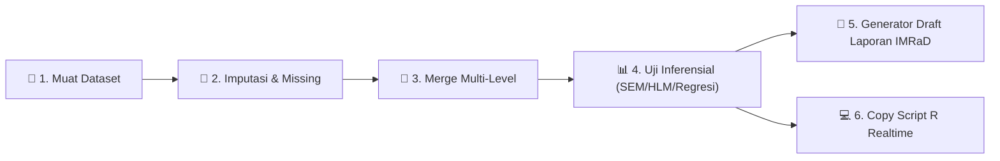
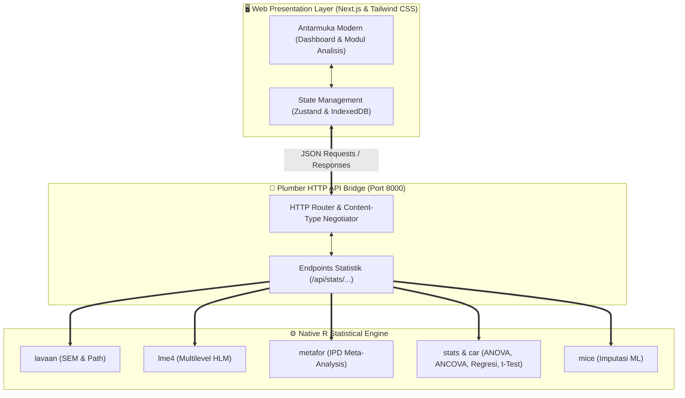

<div align="center">


# 🌟 BBKA Analytics Studio
### *Advanced Educational & Social Science Statistical Suite with Native R Engine*

[](https://github.com/anom90/bbka-analytics)
[](https://nextjs.org/)
[](https://opensource.org/licenses/MIT)
[](https://apastyle.apa.org/)
[](https://github.com/anom90/bbka-analytics)
[]()

<p align="center">
  <b>Platform Analisis Statistik Inferensial & Studio Penulisan Artikel Jurnal Ilmiah Terpadu</b><br>
  Dirancang khusus untuk peserta <b>BBKA Course</b> dan riset pendidikan berskala besar (<b>Asesmen Nasional, PISA, TIMSS, WVS</b>) berstandar publikasi jurnal internasional bereputasi (Q1 / Scopus).
</p>

[⚡ Panduan Cepat Peserta](#-panduan-cepat-peserta-pelatihan-bbka-course) • [📊 Modul Analisis](#-daftar-modul-analisis-statistik) • [📑 Alur Kerja Praktik](#-alur-kerja-praktik-analisis-di-kelas) • [❓ Solusi Kendala (FAQ)](#-tanya-jawab--solusi-kendala-troubleshooting) • [📄 Lisensi](#-lisensi)

---

</div>

## 📌 Ringkasan Eksekutif

**BBKA Analytics Studio** adalah platform analisis statistik canggih yang memadukan keindahan antarmuka web modern (**Next.js, Tailwind CSS, Shadcn UI**) dengan ketepatan komputasi statistik murni dari mesin **R (Plumber, lavaan, lme4, metafor, car, effectsize, mice)**. 

Aplikasi ini dapat dijalankan langsung di dalam **RStudio** hanya dengan 1 baris perintah, tanpa perlu instalasi server web yang rumit.

---

## ⚡ Panduan Cepat Peserta Pelatihan (BBKA Course)

Seluruh peserta pelatihan dapat langsung menginstal dan menjalankan aplikasi di komputer masing-masing (Windows, macOS, maupun Linux).

### 🚀 Cara Menginstal & Membuka Aplikasi di RStudio

1. Buka aplikasi **R** atau **RStudio**.
2. Salin dan tempelkan perintah di bawah ini ke dalam jendela **Console**, lalu tekan **Enter**:

```r
# 1. Pasang paket 'remotes' jika belum terpasang
if (!requireNamespace("remotes", quietly = TRUE)) install.packages("remotes")

# 2. Pasang paket BBKA Analytics Studio dari GitHub
remotes::install_github("anom90/bbka-analytics")

# 3. Panggil dan jalankan aplikasi
library(bbka.analytics)
run_app()
```

3. Browser default Anda (Chrome, Edge, Safari) akan **otomatis terbuka** dan menampilkan halaman utama:
   $$\text{\textbf{http://localhost:8000/data}}$$

> 💡 **Tips Peserta:** Jika browser tidak terbuka otomatis, cukup klik atau ketik link `http://localhost:8000/data` di browser pilihan Anda.

---

## 📑 Alur Kerja Praktik Analisis di Kelas

Aplikasi ini telah dirancang terstruktur mengikuti kaidah metodologi penelitian kuantitatif:



1. **Langkah 1: Muat Data Latihan Bawaan**
   - Di tab *Manajemen Dataset*, peserta dapat langsung menekan tombol **`Muat Data Asesmen Nasional Bawaan`** (berisi 37.247 data siswa dan 15 variabel AN lengkap) untuk langsung mulai praktik tanpa perlu mencari file.
2. **Langkah 2: Diagnosis & Imputasi Data Hilang (Missing Data)**
   - Periksa persentase data hilang dan lakukan imputasi otomatis menggunakan metode *Random Forest (ranger)*, *CART*, atau *Predictive Mean Matching (PMM)* via paket `mice`.
3. **Langkah 3: Penggabungan Data Multi-Level (Merge Siswa & Guru)**
   - Unggah file data guru/Sulingjar, pilih kolom kunci (`kd_sekolah`), dan sistem akan mengagregasi rata-rata sekolah secara otomatis ke data siswa.
4. **Langkah 4: Jalankan Analisis Inferensial**
   - Pilih modul analisis pada sidebar (Uji-t, ANOVA, ANCOVA, MANOVA, Regresi Hirarki, SEM/Path Analysis, Multilevel HLM, atau Meta-Analisis IPD).
5. **Langkah 5: Penyusunan Naskah Publikasi (Draft Laporan)**
   - Masuk ke menu **`Draft Laporan`** untuk menyusun artikel ilmiah instan (Abstrak, Formulasi Matematis LaTeX, Tabel APA 7th, dan Pembahasan) lalu unduh naskah dalam format `.doc`.
6. **Langkah 6: Verifikasi Script R Mandiri**
   - Setiap modul menyediakan blok **Sintaks R Realtime** yang dapat dicopy-paste ke RStudio untuk verifikasi keaslian kalkulasi.

---

## 📊 Daftar Modul Analisis Statistik

| No | Modul Analisis | Engine Paket R | Parameter Utama & Hasil Output |
|:---:|:---|:---:|:---|
| 1 | **Manajemen Dataset & Imputasi** | `mice`, `readxl`, `dplyr` | Diagnosis *missing rate*, imputasi Random Forest/CART/Median, filtering bertingkat, dan penggabungan data multi-level (*merge* siswa-guru). |
| 2 | **Uji-t (t-Test) Komparatif** | `stats::t.test`, `rstatix`, `car` | Uji Independent, Paired, & One-Sample, Levene Homogeneity Test, Welch's t-test koreksi, dan ukuran efek *Cohen's d*. |
| 3 | **ANOVA Faktorial** | `stats::aov`, `car`, `effectsize` | Desain One-Way & Two-Way Faktorial, Type III Sum of Squares, Tukey HSD Post-Hoc, dan *Partial Eta Squared* ($\eta^2_p$). |
| 4 | **ANCOVA (Kovariat)** | `stats::lm`, `emmeans`, `car` | Pengendalian variabel perancu (misal SES), uji homogenitas *slopes*, dan perhitungan *Adjusted Means* (*Estimated Marginal Means*). |
| 5 | **MANOVA Multivariat** | `stats::manova`, `heplots` | Uji simultan multi-dependen kontinu (Literasi & Numerasi) dengan statistik *Wilks' Lambda*, *Pillai's Trace*, dan *Hotelling-Lawley*. |
| 6 | **Regresi Linier & Berjenjang** | `stats::lm`, `lm.beta`, `car` | Regresi OLS berganda bertingkat, $\Delta R^2$, $F$-Change test, *Standardized Beta*, dan diagnostik multikolinieritas *Variance Inflation Factor* (VIF). |
| 7 | **SEM & Path Analysis (Mediasi)** | `lavaan`, `semPlot` | Analisis jalur kausal langsung/tidak langsung (*indirect effect* via *bootstrapping*), serta indeks kelayakan model lengkap (CFI, TLI, RMSEA, SRMR, $\chi^2$). |
| 8 | **Multilevel Modeling (HLM)** | `lme4`, `lmerTest`, `performance` | Dekomposisi varians hierarkis (siswa di dalam sekolah), *Intraclass Correlation Coefficient* (ICC / $\rho$), dan *Fixed Effects* Level 1 & Level 2. |
| 9 | **Two-Stage IPD Meta-Analysis** | `metafor`, `ggplot2` | Meta-analisis mikro per wilayah klaster (Brunner et al., 2022), sintesis koefisien $\beta$, *Forest Plot*, serta diagnostik heterogenitas ($I^2$, $\tau^2$, Cochran's $Q$). |
| 10 | **Studio Draft Laporan IMRaD** | *Native Synthesis Engine* | Penyusunan draf naskah publikasi utuh (Abstrak, Operasionalisasi Variabel, Strategi Formula Matematis LaTeX, Tabel APA 7th, Pembahasan) dan ekspor ke Word (`.doc`). |

---

## ❓ Tanya Jawab & Solusi Kendala (Troubleshooting)

#### 1. Bagaimana cara memperbarui aplikasi ke versi terbaru?
Jalankan perintah berikut di konsol RStudio:
```r
remotes::install_github("anom90/bbka-analytics", force = TRUE)
```

#### 2. Muncul pesan "Port 8000 is already in use"?
Anda dapat menjalankan aplikasi di port lain yang tersedia (misal port 8080):
```r
run_app(port = 8080)
```

#### 3. Bagaimana cara menghentikan server aplikasi di RStudio?
Klik jendela **Console** di RStudio, lalu tekan tombol **Esc** (pada keyboard) atau klik ikon **Stop (tanda merah)** di pojok kanan atas konsol RStudio.

#### 4. Apakah data saya aman dan diunggah ke internet?
**100% Aman & Lokal**. Seluruh proses komputasi statistik dan data mentah tersimpan di dalam memori lokal komputer Anda (IndexedDB browser & sesi R lokal). Tidak ada data riset Anda yang dikirim ke server luar.

---

## 🏗️ Arsitektur Sistem



---

## 📖 Referensi Metodologi & Standar Sitasi

- **American Psychological Association (2020)**. *Publication Manual of the American Psychological Association* (7th ed.).
- **Rosseel, Y. (2012)**. lavaan: An R Package for Structural Equation Modeling. *Journal of Statistical Software*, 48(2), 1-36.
- **Bates, D., Mächler, M., Bolker, B., & Walker, S. (2015)**. Fitting Linear Mixed-Effects Models Using lme4. *Journal of Statistical Software*, 67(1), 1-48.
- **Viechtbauer, W. (2010)**. Conducting meta-analyses in R with the metafor package. *Journal of Statistical Software*, 36(3), 1-48.
- **van Buuren, S., & Groothuis-Oudshoorn, K. (2011)**. mice: Multivariate Imputation by Chained Equations in R. *Journal of Statistical Software*, 45(3), 1-67.
- **Brunner, M., et al. (2022)**. Two-Stage IPD Meta-Analysis for Large-Scale Educational Assessments. *Large-scale Assessments in Education*.

---

## 📄 Lisensi

Didistribusikan di bawah Lisensi **MIT**. Hak Cipta © 2026 **Kartianom** • **BBKA Analytics Studio**.

---

<div align="center">
  <b>Bimbingan Belajar & Konsultasi Akademik (BBKA Course)</b><br>
  <i>Empowering Researchers with High-Performance Open-Source Statistical Computing</i>
</div>
