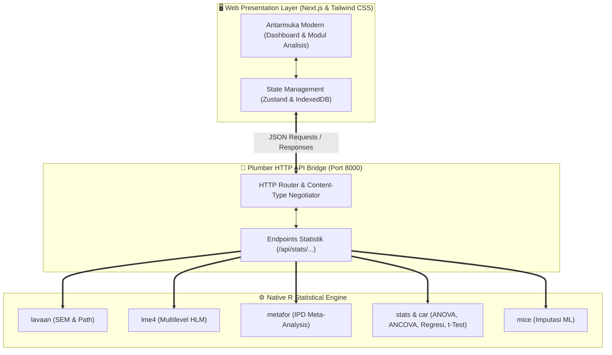

<div align="center">

# 🌟 BBKA Analytics Studio
### *Advanced Educational & Social Science Statistical Suite with Native R Engine*

[](https://github.com/anom90/bbka-analytics)
[](https://nextjs.org/)
[](https://opensource.org/licenses/MIT)
[](https://apastyle.apa.org/)
[]()

<p align="center">
  <b>Suite Analisis Statistik & Studio Publikasi Ilmiah Terpadu</b><br>
  Dirancang khusus untuk riset berskala besar (<b>Asesmen Nasional, PISA, TIMSS, WVS</b>) dan penelitian ilmu sosial komparatif berstandar jurnal bereputasi tinggi (Q1 / Scopus).
</p>

[Fitur Utama](#-fitur-utama) • [Instalasi di R](#-instalasi--penggunaan-di-r) • [Modul Analisis](#-modul-analisis-statistik) • [Cara Kerja Sistem](#-arsitektur-sistem) • [Lisensi](#-lisensi)

---

</div>

## 📌 Ringkasan Eksekutif

**BBKA Analytics Studio** adalah platform analisis data mutakhir yang menggabungkan kecepatan dan fleksibilitas antarmuka modern **Next.js & Tailwind CSS** dengan keakuratan komputasi mesin murni **R (Plumber, lavaan, lme4, metafor, car, effectsize)**. 

Aplikasi ini dapat dijalankan langsung di dalam **R / RStudio**, melalui instalasi paket GitHub, maupun sebagai aplikasi web mandiri (*standalone web server*).

---

## 🚀 Fitur Utama

- ⚡ **R Native Computational Engine**: Seluruh kalkulasi inferensial dijalankan oleh paket statistik resmi R (`stats::lm`, `lavaan::sem`, `lme4::lmer`, `metafor::rma`, `stats::aov`, `car::Anova`, `mice`).
- 🔄 **Reactivity & Real-Time R Code Generation**: Setiap konfigurasi variabel secara otomatis memproduksi sintaks R (*copy-paste ready*) yang dapat diuji coba langsung di RStudio.
- 📑 **Penyusun Draft Laporan Multi-Tahap (IMRaD & APA 7th)**: Generator otomatis naskah artikel ilmiah terintegrasi yang menyatukan hasil regresi berganda, uji mediasi (*path analysis* dengan *bootstrap*), multilevel HLM, dan formulasi matematis LaTeX formal ($Y_i = \beta_0 + \sum \beta_k X_{ki} + \dots$).
- 🗄️ **Manajemen & Penggabungan Data Multi-Level (Merge Siswa Level 1 & Guru Level 2)**: Dilengkapi dengan *drag-and-drop dropzone*, deteksi multi-sheet Excel, agregasi data satuan pendidikan otomatis, dan diagnostik kecocokan kunci relasi.
- 🧹 **Diagnosis Data Hilang & Imputasi Machine Learning**: Integrasi penuh *Random Forest (ranger)*, *Classification & Regression Trees (CART)*, dan *Predictive Mean Matching (PMM)* via paket `mice`.
- 💾 **Sesi Lokal & Manajemen Memori**: Bekerja optimal secara *offline* menggunakan browser storage (IndexedDB) dengan dukungan ekspor dataset ke format `.csv`, `.xlsx`, dan `.json`.

---

## 💻 Instalasi & Penggunaan di R

### Opsi 1: Instalasi sebagai Paket R dari GitHub (Direkomendasikan)

Buka konsol **R** atau **RStudio**, lalu jalankan perintah berikut:

```r
# 1. Pasang paket 'remotes' atau 'devtools' jika belum tersedia
if (!requireNamespace("remotes", quietly = TRUE)) install.packages("remotes")

# 2. Pasang BBKA Analytics Studio langsung dari GitHub
remotes::install_github("anom90/bbka-analytics")

# 3. Muat paket dan jalankan aplikasi
library(bbka.analytics)
run_app()
```

> **Catatan**: Perintah `run_app()` akan otomatis menghentikan sesi server lama yang menggantung, menyiapkan seluruh dependensi R yang dibutuhkan, dan membuka antarmuka web interaktif di browser default Anda pada `http://localhost:8000/data`.

---

### Opsi 2: Menjalankan Langsung via Clone / Download Script

Jika Anda mengunduh atau meng-clone repository ini secara lokal:

```bash
git clone https://github.com/anom90/bbka-analytics.git
cd bbka-analytics
```

Buka file `run_app.R` di RStudio dan jalankan:

```r
source("run_app.R")
run_app()
```

---

## 📊 Modul Analisis Statistik

| No | Modul Analisis | Engine Paket R | Parameter Kunci & Output yang Dihasilkan |
|:---:|:---|:---:|:---|
| 1 | **Manajemen Dataset & Imputasi** | `mice`, `readxl`, `dplyr` | Diagnosis *missing rate*, imputasi Random Forest/CART/Median, filtering bertingkat, dan penggabungan data multi-level (*merge* siswa-guru). |
| 2 | **Uji-t (t-Test) Komparatif** | `stats::t.test`, `rstatix`, `car` | Uji Independent, Paired, & One-Sample, Levene Homogeneity Test, Welch's t-test koreksi, dan ukuran efek *Cohen's d*. |
| 3 | **ANOVA Faktorial** | `stats::aov`, `car`, `effectsize` | Desain One-Way & Two-Way Faktorial, Type III Sum of Squares, Tukey HSD Post-Hoc, dan *Partial Eta Squared* ($\eta^2_p$). |
| 4 | **ANCOVA (Kovariat)** | `stats::lm`, `emmeans`, `car` | Pengendalian variabel perancu (misal SES), uji homogenitas *slopes*, dan perhitungan *Adjusted Means* (*Estimated Marginal Means*). |
| 5 | **MANOVA Multivariat** | `stats::manova`, `heplots` | Uji simultan multi-dependen kontinu (Literasi & Numerasi) dengan statistik *Wilks' Lambda*, *Pillai's Trace*, dan *Hotelling-Lawley*. |
| 6 | **Regresi Linier & Berjenjang** | `stats::lm`, `lm.beta`, `car` | Regresi OLS berganda bertingkat, $\Delta R^2$, $F$-Change test, *Standardized Beta*, dan diagnostik multikolinieritas *Variance Inflation Factor* (VIF). |
| 7 | **SEM & Path Analysis (Mediasi)** | `lavaan`, `semPlot` | Analisis jalur kausal langsung/tidak langsung (*indirect effect* via *bootstrapping*), serta indeks kelayakan model lengkap (CFI, TLI, RMSEA, SRMR, $\chi^2$). |
| 8 | **Multilevel Modeling (HLM)** | `lme4`, `lmerTest`, `performance` | Dekomposisi varians hierarkis (siswa di dalam sekolah), *Intraclass Correlation Coefficient* (ICC / $\rho$), dan *Fixed Effects* Level 1 & Level 2. |
| 9 | **Two-Stage IPD Meta-Analysis** | `metafor`, `ggplot2` | Meta-analisis mikro per wilayah klaster (Brunner et al., 2022), sintesis koefisien $\beta$, *Forest Plot*, serta diagnostik heterogenitas ($I^2$, $\tau^2$, Cochran's $Q$). |
| 10 | **Studio Draft Laporan IMRaD** | *Native Synthesis Engine* | Penyusunan draf naskah publikasi utuh (Abstrak, Operasionalisasi Variabel, Strategi Formula Matematis LaTeX, Tabel APA 7th, Pembahasan) dan ekspor ke Word (`.doc`). |

---

## 🏗️ Arsitektur Sistem



---

## 🐳 Opsi Penggunaan via Docker

Jika ingin menjalankan server berbasis kontainer tanpa instalasi R lokal:

```bash
# Build dan jalankan dengan Docker Compose
docker-compose up -d --build
```
Buka browser pada `http://localhost:8000/data`.

---

## 📖 Referensi & Standar Metodologi

- **American Psychological Association (2020)**. *Publication Manual of the American Psychological Association* (7th ed.).
- **Rosseel, Y. (2012)**. lavaan: An R Package for Structural Equation Modeling. *Journal of Statistical Software*, 48(2), 1-36.
- **Bates, D., Mächler, M., Bolker, B., & Walker, S. (2015)**. Fitting Linear Mixed-Effects Models Using lme4. *Journal of Statistical Software*, 67(1), 1-48.
- **Viechtbauer, W. (2010)**. Conducting meta-analyses in R with the metafor package. *Journal of Statistical Software*, 36(3), 1-48.
- **van Buuren, S., & Groothuis-Oudshoorn, K. (2011)**. mice: Multivariate Imputation by Chained Equations in R. *Journal of Statistical Software*, 45(3), 1-67.
- **Brunner, M., et al. (2022)**. Two-Stage IPD Meta-Analysis for Large-Scale Educational Assessments. *Large-scale Assessments in Education*.

---

## 📄 Lisensi

Didistribusikan di bawah Lisensi **MIT**. Lihat berkas [LICENSE](LICENSE) untuk rincian lengkap.

---

<div align="center">
  <b>Dikembangkan untuk Bimbingan Riset & Analisis Data Pendidikan Berkualitas Tinggi</b><br>
  © 2026 Kartianom • <b>BBKA Analytics Studio</b>
</div>
